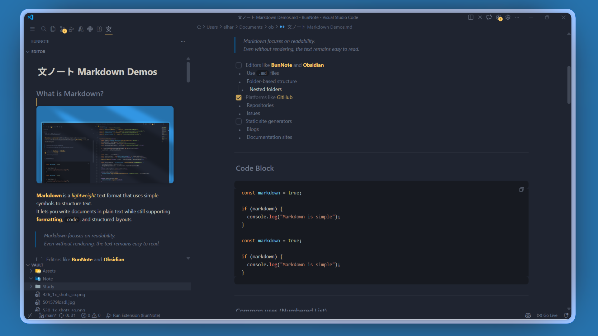
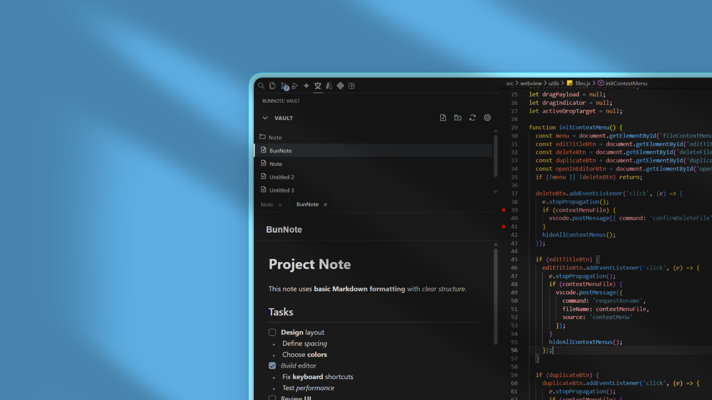

<div align="center">


# 文ノート (BunNote)

[](https://marketplace.visualstudio.com/items?itemName=elharis.bunnote)
[](https://marketplace.visualstudio.com/items?itemName=elharis.bunnote)
[](https://marketplace.visualstudio.com/items?itemName=elharis.bunnote)
[](https://github.com/elhariss/BunNote/blob/main/LICENSE)

[English](#english) | [日本語](#japanese)

</div>


文ノート（BunNote）は、VS Code上でマークダウンノートを作成・管理できる無料のオープンソース拡張機能です。Obsidianなどの外部マークダウンエディタと同一のVaultを利用でき、スムーズに連携できます。
<div align="center">


---


</div>

### ダウンロード

VS Code拡張機能マーケットプレイスより「BunNote」をインストールできます。

### ドキュメント

#### クイックリンク

- [インストール](#インストール)
- [使い方](#使い方)
- [設定](#設定)
- [マークダウン記法](#マークダウン機能)

### 主な機能

- 階層構造のフォルダでノートを整理
- リッチなWYSIWYGマークダウンエディタ（表・画像・数式に対応）
- シンタックスハイライト機能付きコードブロック
- ノート間の高速検索とナビゲーション
- タブ機能による複数ノートの同時編集
- Obsidianなど外部アプリケーションとのリアルタイム同期
- ファイル・フォルダのドラッグ&ドロップ移動
- タスクリスト（チェックボックス）機能
- VS Codeテーマとの完全統合
- 自動保存
- コンテキストメニューによる快適な編集
- インデントガイドで階層を視覚的に表示

### インストール

#### VS Code拡張機能マーケットプレイスからインストール

1. VS Codeを起動
2. 拡張機能ビュー（`Ctrl+Shift+X`）を開く
3. 「BunNote」で検索
4. 「インストール」をクリック

#### 手動インストール

1. 最新リリースから`.vsix`ファイルをダウンロード
2. VS Codeで`Ctrl+Shift+P`を押してコマンドパレットを開く
3. 「Extensions: Install from VSIX...」を選択
4. ダウンロードした`.vsix`ファイルを選択

### 使い方

#### 初期設定

1. アクティビティバーのBunNoteアイコンをクリック
2. 設定アイコンをクリックしてVS Codeの設定画面を開く
3. `bunnote.vaultPath`にVaultフォルダのパスを指定
4. または、コマンドパレット（`Ctrl+Shift+P`）で「BunNote: Set Vault Folder」を実行

#### ノートの作成と管理

**新規ノート作成**
- ツールバーの「New Note」アイコンをクリック
- コマンドパレットから「BunNote: Create New Note」を実行

**新規フォルダ作成**
- ツールバーの「New Folder」アイコンをクリック
- フォルダを右クリックして「New folder」を選択

**ノートの編集**
- ファイル一覧からノートをクリックして開く
- マークダウンファイルを右クリックして「Open in Editor」を選択すると、VS Codeのメインエディタエリアで開く
- マークダウン記法で自由に編集
- 変更内容は自動的に保存されます

**エディタモード**
- サイドバーエディタ: デフォルトのBunNoteサイドバー内でノートを編集
- カスタムエディタ: VS Codeのメインエディタエリアでノートを編集（右クリック→「Open in Editor」）
- どちらのモードでも同じマークダウンレンダリングとシンタックス非表示機能を使用できます

**ファイル操作**
- 右クリックでコンテキストメニューを表示
- ドラッグ&ドロップでファイルやフォルダを自由に移動
- ファイル名の変更・複製・削除が可能

#### マークダウン機能

BunNoteは標準的なマークダウン記法に対応しています：

- 見出し: `#`, `##`, `###`
- 太字: `**テキスト**`
- 斜体: `*テキスト*`
- 取り消し線: `~~テキスト~~`
- 箇条書き: `-` または `*`
- 番号付きリスト: `1.`, `2.`, `3.`
- タスクリスト: `- [ ]` または `- [x]`
- 引用: `>`
- コードブロック: ` ``` `
- インラインコード: `` `コード` ``
- 水平線: `---`
- リンク: `[テキスト](URL)`
- 画像: ``

#### 外部アプリケーションとの連携

BunNoteは、Obsidianなど他のマークダウンエディタと同じVaultフォルダを共有できます。

- 外部アプリでファイルを変更すると、BunNoteが自動的に検出して反映
- ファイルの作成・削除も自動的に同期
- 手動更新する場合は、ツールバーの「Refresh」アイコンをクリック

### 設定

VS Codeの設定（`settings.json`）で以下の項目をカスタマイズできます：

**bunnote.vaultPath**
- 型: `string`
- デフォルト: `""`
- 説明: 現在のワークスペースで使用するVaultフォルダのパス

**bunnote.defaultVaultPath**
- 型: `string`
- デフォルト: `""`
- 説明: デフォルトで使用するVaultフォルダのパス

**bunnote.autoUseDefaultVault**
- 型: `boolean`
- デフォルト: `true`
- 説明: ワークスペースでVaultが未設定の場合、デフォルトVaultを自動的に使用する

設定画面を開くには、BunNoteパネルの設定アイコンをクリックしてください。

### コマンド一覧

コマンドパレット（`Ctrl+Shift+P`）から以下のコマンドを実行できます：

- `BunNote: Set Vault Folder` - Vaultフォルダを設定
- `BunNote: Create New Note` - 新規ノートを作成
- `BunNote: Refresh Files` - ファイル一覧を更新
- `BunNote: Open Settings` - BunNote設定画面を開く

### 開発に参加する

#### コードの貢献

リポジトリをクローンして、依存関係をインストール後、開発サーバーを起動：

```bash
git clone https://github.com/elhariss/BunNote
cd bunnote
npm install
```

VS Codeで`F5`を押すと、拡張機能開発ホストが起動します。

#### バグ報告・機能リクエスト

GitHubのIssuesページにて、バグ報告や機能リクエストを受け付けています。

### ライセンス

本プロジェクトは [MIT](https://github.com/elhariss/BunNote/blob/main/LICENSE)ライセンスの下で公開されています。

### コントリビューション

バグ報告、機能リクエスト、プルリクエストを歓迎します！詳細は[CONTRIBUTING.md](CONTRIBUTING.md)をご覧ください。

### サポート

- 🐛 [バグ報告](https://github.com/elhariss/BunNote/issues/new?template=bug_report_ja.yml)
- 💡 [機能リクエスト](https://github.com/elhariss/BunNote/issues/new?template=feature_request_ja.yml)
- ⭐ このプロジェクトが役に立ったら、GitHubでスターをお願いします！